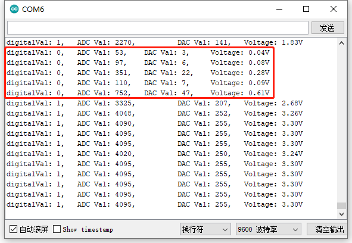

# 第二十五课 火焰传感器

## 1.1 项目介绍

在这个套件中，有一个Keyes 火焰传感器，它对火焰光谱特别灵敏，且灵敏度可调。性能稳定，是救火机器人的必备部件。火焰传感器上有一个远红外火焰探头，起着非常重要的作用，它可以用作机器人的眼睛来寻找火源或足球。利用它可以制作灭火机器人、足球机器人等。

该传感器有两个信号输出端，分别可输出数字信号与模拟信号。实验中，我们分别读取模块传感器数字信号与模拟信号，将测试结果在串口监视器上显示。

---

## 1.2 模块参数

工作电压 : DC 3.3 ~ 5V

电流 : 100 mA

最大功率 : 0.5 W

输出信号 ：模拟信号和数字信号

工作温度 ：-10°C ~ +50°C

尺寸 ：32 x 23.8 x 9.2 mm

定位孔大小：直径为 4.8 mm

接口 ：间距为2.54 mm 4pin防反接口

---

## 1.3 模块原理图

红外火焰传感器能够探测到波长在700纳米～1000纳米范围内的红外光，探测角度为60，其中红外光波长在880纳米附近时，其灵敏度达到最大。从电路原理图我们可以看到，上电后红色LED2先点亮，红色LED1处于熄灭状态，检测到火焰时，数字信号端D0输出低电平，红色LED1将点亮。红外火焰探头将外界红外光的强弱变化转化为电流的变化，通过A/D转换器反映为0～255范围内数值的变化。外界红外光越强，数值越小；红外光越弱，数值越大。


---

## 1.4 实验组件

|  |  |        |  |
| ------------------------ | ------------------------ | ---------------------------- | --------------------- |
| ESP32 Plus主板 x1        | Keyes 火焰传感器 x1      | XH2.54-4P 转杜邦线母单线  x1 | USB线  x1             |

---

## 1.5 模块接线图


---

## 1.6 实验代码

本项目中使用的代码保存在文件夹“<u>**3. Arduino教程\2. Windows 系统\1. 项目课程\代码**</u>”中，我们可以在此路径下打开代码文件''**Flame_sensor.ino**"。

**注意：为了避免上传代码不成功，请上传代码前不要连接模块。代码上传成功后，拔下USB线断电，按照接线图正确接好模块后再用USB线连接到计算机上电，观察实验结果。**

```c++
 /*  
 * 名称   : Flame sensor
 * 功能   : 火焰传感器接收到的模拟值转换为ADC,DAC和电压值
 * 作者   : http://www.keyes-robot.com/ 
*/
//火焰传感器的两个引脚分别是13和34
#define PIN_ANALOG_IN  34 
int digitalPin = 13;

//以下两个变量分别保存数字信号和adc值
int analogVal = 0;
int adcVal = 0;

void setup() {
  Serial.begin(9600);
  pinMode(digitalPin, INPUT); //数字引脚13设置为输入模式
}

//在loop()中，digitalRead()函数用于获取数字值，
//analogRead()函数用于获取ADC值。
//然后使用map()函数将该值转换为8位精度DAC值。
//输入输出电压按上式计算，
//最后将信息打印出来。
void loop() {
  int digitalVal = digitalRead(digitalPin);  //读取数字信号
  int adcVal = analogRead(PIN_ANALOG_IN);
  int dacVal = map(adcVal, 0, 4095, 0, 255);
  double voltage = adcVal / 4095.0 * 3.3;
  Serial.printf("digitalVal: %d, \t ADC Val: %d, \t DAC Val: %d, \t Voltage: %.2fV\n",digitalVal, adcVal, dacVal, voltage);
  delay(200);
}
```

ESP32主板通过USB线连接到计算机后开始上传代码。为了避免将代码上传至ESP32主板时出现错误，必须选择与计算机连接正确的控制板和串行端口。

点击“**<u>工具</u>**”→“**<u>开发板</u>**”，可以查看到各种不同型号ESP32开发板，选择对应的ESP32开发板型号。

点击“<u>**工具**</u>”→“**<u>端口</u>**”，选择对应的串行端口。

**注意：将ESP32主板通过USB线连接到计算机后才能看到对应的串行端口**。

单击将代码上传到ESP32主控板，等待代码上传成功后查看实验结果。

---

## 1.7 实验结果

代码上传成功后，拔下USB线断电，按照接线图正确接好模块后再用USB线连接到计算机上电。此时火焰传感器上的红色LED2点亮。旋转火焰传感器上的电位器，微调使传感器上红色LED1灯介于亮与不亮之间的**不亮**状态。


打开串口监视器，设置波特率为**<u>9600</u>**。串口监视器打印出火焰传感器的digital值，ADC值，DAC值和电压值。当传感器检测到火焰时，红色LED1点亮，在串口监视器中可以看到数字值由1变为0，ADC值，DAC值和电压值变小。



---

## 1.8 代码说明

 此课程代码与第十九课代码类似，这里就不多做介绍了。   
