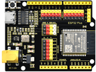
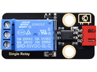

# 第二十八课 继电器模块

## 1.1 项目介绍

在日常生活中，一般使用交流电来驱动电气设备，有时我们会用开关来控制电器。如果将开关直接连接到交流电路上，一旦发生漏电，人就有危险。从安全的角度考虑，我们特别设计了这款具有NO（常开）端和NC（常闭）端的继电器模块。

---

## 1.2 模块参数

工作电压 : DC 5V 

电流 : 50 mA

最大功率 : 0.25 W

输入信号 : 数字信号

触电电流 : 小于 3 A

工作温度 ：-10°C ~ +50°C

控制信号 : 数字信号

尺寸 ：47.6 x 23.8 x 19 mm

定位孔大小：直径为 4.8 mm

接口 ：间距为2.54 mm 3pin防反接口

---

## 1.3 模块原理图


一个继电器拥有一个动触点以及两个静触点A和B。

当开关K断开时，继电器线路无电流通过，此时动触点与静触点B相接触，上半部分的电路导通。静触点B被称为常闭触点（NC）。常闭——NC（normal close）通常情况下是关合状态，即线圈未得电的情况下闭合的。

当开关K闭合时，继电器电路通过电流产生磁力，此时动触点与静触点A相接触，下半部分电路导通。静触点A被称为常开触点（NO）。常开——NO（normal open）通常情况下是断开状态，即线圈未得电的情况下断开的。

而动触点也被称为公共触点（COM）。

继电器简单来说就是一个开关，VCC表示电源正极、GND表示电源负极、IN表示信号输入脚，COM表示公共端，NC（normal close）表示常闭端，NO(normal open)表示常开端。


继电器能兼容多种单片机控制板，是用小电流去控制大电流运作的一种“自动开关”。它可以让单片机控制板驱动3A以下负载，如LED灯带、直流马达、微型水泵、电磁阀可插拔式接口设计，方便使用。

---

## 1.4 实验组件

|  |   |        |  |
| ------------------------ | ------------------------- | ---------------------------- | --------------------- |
| ESP32 Plus主板 x1        | Keyes 单路5V继电器模块 x1 | XH2.54-3P 转杜邦线母单线  x1 | USB线  x1             |

---

## 1.5 模块接线图


---

## 1.6 实验代码

本项目中使用的代码保存在文件夹“<u>**3. Arduino教程\2. Windows 系统\1. 项目课程\代码**</u>”中，我们可以在此路径下打开代码文件''**Relay.ino**"。

**注意：为了避免上传代码不成功，请上传代码前不要连接模块。代码上传成功后，拔下USB线断电，按照接线图正确接好模块后再用USB线连接到计算机上电，观察实验结果。**

```c++
/*
 * 名称   : Relay
 * 功能   : 继电器开、关
 * 作者   : http://www.keyes-robot.com/ 
*/
#define  Relay  13 //定义继电器的引脚为GPIO13
void setup()
{
pinMode(Relay, OUTPUT); //设置“继电器”为“输出”
}
void loop()
{
digitalWrite(Relay, HIGH); //打开继电器
delay(1000); //延迟1秒
digitalWrite(Relay, LOW);  //关闭继电器
delay(1000); //延迟1秒
}
```

ESP32主板通过USB线连接到计算机后开始上传代码。为了避免将代码上传至ESP32主板时出现错误，必须选择与计算机连接正确的控制板和串行端口。

点击“**<u>工具</u>**”→“**<u>开发板</u>**”，可以查看到各种不同型号ESP32开发板，选择对应的ESP32开发板型号。

点击“<u>**工具**</u>”→“**<u>端口</u>**”，选择对应的串行端口。

**注意：将ESP32主板通过USB线连接到计算机后才能看到对应的串行端口**。

单击将代码上传到ESP32主控板，等待代码上传成功后查看实验结果。

---

## 1.7 实验结果

代码上传成功后，拔下USB线断电，按照接线图正确接好模块后再用USB线连接到计算机上电。

继电器将循环开与关，开启1秒，关闭1秒。同时可以听到继电器开与关的声音，还可以看到继电器上的指示灯指示状态的变化。

---

## 1.8 代码说明

 此课程代码与第二课代码类似，这里就不多做介绍了。 
