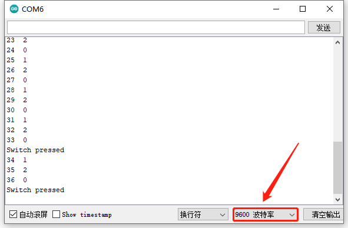

# 第四十四课 旋转编码器控制RGB

## 1.1 项目介绍

在第三十课的实验中我们学习了使用旋转编码器计数。在这一实验课程中我们将旋转编码器模块和共阴RGB模块组合实验，通过旋转编码器计数的结果，控制RGB模块上LED显示不同的颜色。

---

## 1.2 实验组件

|      |      |  |
| ---------------------------- | ---------------------------- | ------------------------ |
| ESP32 Plus主板 x1            | Keyes 旋转编码器模块 x1      | Keyes 共阴RGB模块 x1     |
|        |        |     |
| XH2.54-5P 转杜邦线母单线  x1 | XH2.54-4P 转杜邦线母单线  x1 | USB线  x1                |

---

## 1.3 模块接线图


---

## 1.4 实验代码

本项目中使用的代码保存在文件夹“<u>**3. Arduino教程\2. Windows 系统\1. 项目课程\代码**</u>”中，我们可以在此路径下打开代码文件''**Encoder_control_RGB.ino**"。

**注意：为了避免上传代码不成功，请上传代码前不要连接模块。代码上传成功后，拔下USB线断电，按照接线图正确接好模块后再用USB线连接到计算机上电，观察实验结果。**

```c++
/*  
 * 名称   : Encoder control RGB
 * 功能   : 旋转编码器控制RGB来呈现不同的效果
 * 作者   : http://www.keyes-robot.com/ 
*/
//旋转编码器接口
int Encoder_DT  = 27;
int Encoder_CLK  = 14;
int Encoder_Switch = 16;

int Previous_Output;
int Encoder_Count;

int ledPins[] = {32, 4, 2};    //定义红色，绿色，蓝色引脚
const byte chns[] = {0, 1, 2}; //定义PWM通道
int red, green, blue;

int val;
void setup() {
  Serial.begin(9600);

  //引脚模式声明
  pinMode (Encoder_DT, INPUT);
  pinMode (Encoder_CLK, INPUT);
  pinMode (Encoder_Switch, INPUT);

  Previous_Output = digitalRead(Encoder_DT); //读取输出DT的初始值
  for (int i = 0; i < 3; i++) {   //设置pwm通道，1KHz,8bit
    ledcSetup(chns[i], 1000, 8);
    ledcAttachPin(ledPins[i], chns[i]);
   }
}

void loop() {
  if (digitalRead(Encoder_DT) != Previous_Output)
  {
    if (digitalRead(Encoder_CLK) != Previous_Output)
    {
      Encoder_Count ++;
      Serial.print(Encoder_Count);
      Serial.print("  ");
      val = Encoder_Count % 3;
      Serial.println(val);
    }
    else
    {
      Encoder_Count--;
      Serial.print(Encoder_Count);
      Serial.print("  ");
      val = Encoder_Count % 3;
      Serial.println(val);
    }
  }

  Previous_Output = digitalRead(Encoder_DT);

  if (digitalRead(Encoder_Switch) == 0)
  {
    delay(5);
    if (digitalRead(Encoder_Switch) == 0) {
      Serial.println("Switch pressed");
      while (digitalRead(Encoder_Switch) == 0);
    }
  }
  if (val == 0) {
    //红色(255, 0, 0)
    ledcWrite(chns[0], 255 ); 
    ledcWrite(chns[1], 0);
    ledcWrite(chns[2], 0);
  } else if (val == 1) {
    //绿色(0, 255, 0)
    ledcWrite(chns[0], 0); 
    ledcWrite(chns[1], 255);
    ledcWrite(chns[2], 0);
  } else {
    //蓝色(0, 0, 255)
    ledcWrite(chns[0], 0); 
    ledcWrite(chns[1], 0);
    ledcWrite(chns[2], 255);
  }
}
```

ESP32主板通过USB线连接到计算机后开始上传代码。为了避免将代码上传至ESP32主板时出现错误，必须选择与计算机连接正确的控制板和串行端口。

点击“**<u>工具</u>**”→“**<u>开发板</u>**”，可以查看到各种不同型号ESP32开发板，选择对应的ESP32开发板型号。

点击“<u>**工具**</u>”→“**<u>端口</u>**”，选择对应的串行端口。

**注意：将ESP32主板通过USB线连接到计算机后才能看到对应的串行端口**。

单击将代码上传到ESP32主控板，等待代码上传成功后查看实验结果。

---

## 1.5 实验结果

代码上传成功后，拔下USB线断电，按照接线图正确接好模块后再用USB线连接到计算机上电，打开串口监视器，设置波特率为**<u>9600</u>**。

任意方向旋转编码器，串口监视器打印出对应余数；RGB模块上的LED显示余数对应的颜色：余数0显示红色、余数1显示绿色、余数2显示蓝色。按下旋转编码器，RGB模块上LED保持当前颜色不变。



---

## 1.6 代码说明

| 代码                                 | 说明                                                         |
| ------------------------------------ | ------------------------------------------------------------ |
| ous_Output = digitalRead(Encoder_DT) | 读取输出DT的初始值。                                         |
| ledcSetup(chns[i], 1000, 8)          | 设置pwm通道，1KHz,8bit。                                     |
| al = Encoder_Count % 3               | %是模除运算符。代码中模除的结果是旋转编码器计数的值与3相除的余数。 |

 
