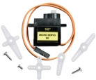
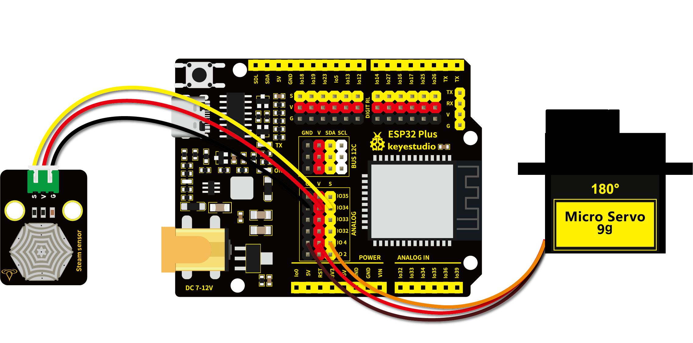

# 第四十六课 模拟智能窗户

## 1.1 项目介绍

生活中能看到各种各样的智能产品，例如智能窗帘、智能窗户、智能电视、智能灯光等等。这一课我们来学习做一个智能窗帘，利用水滴水蒸气传感器模块检测雨水，然后通过设置舵机的角度来达到关窗和开窗的效果。

当然，这只是我们模拟的一个场景，主要用于加深我们的印象，达到对模块学以致用的效果。现实生活中，智能窗户并不是使用舵机来开关的。

---

## 1.2 实验组件

|  |  |  |        |  |
| ------------------------ | ------------------------ | -------------------- | ---------------------------- | --------------------- |
| ESP32 Plus主板 x1        | Keyes 水滴传感器 x1      | 9G 180度数字舵机 x1  | XH2.54-3P 转杜邦线母单线  x1 | USB线  x1             |

---

## 1.3 模块接线图



---

## 1.4 实验代码

本项目中使用的代码保存在文件夹“<u>**3. Arduino教程\2. Windows 系统\1. 项目课程\代码**</u>”中，我们可以在此路径下打开代码文件''**Smart_window.ino**"。

**注意：为了避免上传代码不成功，请上传代码前不要连接模块。代码上传成功后，拔下USB线断电，按照接线图正确接好模块后再用USB线连接到计算机上电，观察实验结果。**

```c++
/*  
 * 名称   : smart window
 * 功能   : 水滴传感器控制舵机转动
 * 作者   : http://www.keyes-robot.com/ 
*/
#include <ESP32Servo.h> //导入舵机库文件
int adcVal = 0;         //保存液滴传感器输出的ADC值的变量
int servoPin = 4;       // 定义伺服引脚
Servo myservo;          //定义舵机类的实例

#define PIN_ADC    34   //水滴传感器的引脚

void setup(){
  Serial.begin(9600);
  pinMode(PIN_ADC, INPUT);
  myservo.setPeriodHertz(50);           //标准50赫兹伺服
  myservo.attach(servoPin, 500, 2500);  // 将servoPin上的伺服附加到伺服对象上
}

void loop(){
  adcVal = analogRead(PIN_ADC); //液滴传感器连接到模拟端口GP34
  Serial.println(adcVal);
  if (adcVal > 2000) { //模拟值大于2000
    myservo.write(0);  //关上窗户
    delay(500); //给舵机转向的时间
  } else { // 没有下雨
    myservo.write(180); //打开窗户
    delay(500); //延迟500毫秒
  }
}
```

ESP32主板通过USB线连接到计算机后开始上传代码。为了避免将代码上传至ESP32主板时出现错误，必须选择与计算机连接正确的控制板和串行端口。

点击“**<u>工具</u>**”→“**<u>开发板</u>**”，可以查看到各种不同型号ESP32开发板，选择对应的ESP32开发板型号。

点击“<u>**工具**</u>”→“**<u>端口</u>**”，选择对应的串行端口。

**注意：将ESP32主板通过USB线连接到计算机后才能看到对应的串行端口**。

单击将代码上传到ESP32主控板，等待代码上传成功后查看实验结果。

---

## 1.5 实验结果

代码上传成功后，拔下USB线断电，按照接线图正确接好模块后再用USB线连接到计算机上电。当水滴传感器检测到一定水量，舵机转动达到关窗的效果。否则舵机转动到另一个角度，达到开窗的效果。

---

## 1.6 代码说明

此课程代码与第四十三课代码类似，这里就不多做介绍了。 
