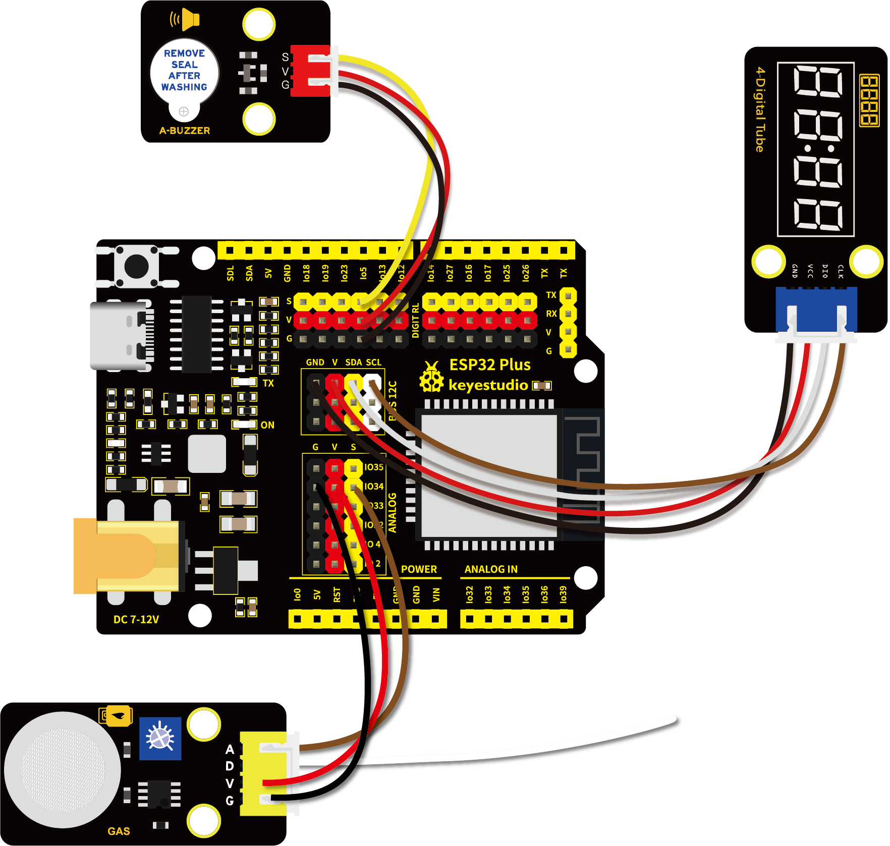

# 第四十九课 烟雾报警器

## 1.1 项目介绍

在前面课程中，我们学习了如何使用有源蜂鸣器模块、学习了如何使用MQ-2 烟雾传感器检测可燃气体、还学会了如何控制四位数码管显示数字或字符。这一课程，我们尝试着将这三个实验结合在一起，制作一个烟雾报警器。制作思路是通过烟雾传感器测试出可燃气体的浓度，然后利用检测结果控制有源蜂鸣器报警、四位数码管显示检测到的值。

---

## 1.2 实验组件

|      |      |  |  |
| ---------------------------- | ---------------------------- | ------------------------ | ------------------------ |
| ESP32 Plus主板 x1            | Keyes 有源蜂鸣器模块 x1      | Keyes 模拟气体传感器 x1  | Keyes 四位数码管模块 x1  |
|        |        |     |                          |
| XH2.54-3P 转杜邦线母单线  x1 | XH2.54-4P 转杜邦线母单线  x2 | USB线  x1                |                          |

---

## 1.3 模块接线图



---

## 1.4 实验代码

本项目中使用的代码保存在文件夹“<u>**3. Arduino教程\2. Windows 系统\1. 项目课程\代码**</u>”中，我们可以在此路径下打开代码文件''**smoke_alarm.ino**"。

**注意：为了避免上传代码不成功，请上传代码前不要连接模块。代码上传成功后，拔下USB线断电，按照接线图正确接好模块后再用USB线连接到计算机上电，观察实验结果。**

```c++
/*  
 * 名称   : smoke alarm
 * 功能   : MQ2控制一个蜂鸣器和一个四位数模拟烟雾测试仪
 * 作者   : http://www.keyes-robot.com/ 
*/
#include "TM1650.h" //导入TM1650库文件
int adcVal = 0; 
//接口为GPIO21和GPIO22
#define DIO 21
#define CLK 22
TM1650 DigitalTube(CLK,DIO);

void setup() {
  DigitalTube.setBrightness();  //设置亮度，0- 7，默认值:2
  DigitalTube.displayOnOFF();   //显示打开或关闭，0=显示关闭，1=显示打开，默认值:1
  for(char b=1;b<5;b++){
    DigitalTube.clearBit(b);    //DigitalTube.clearBit(0 to 3); 清空位显示
  }
  // DigitalTube.displayDot(1,true); //Bit0 显示点。在displayBit()之前使用。
  DigitalTube.displayBit(1,0);    //DigitalTube.Display (,);位= 0 - 3号= 0 - 9
  pinMode(5, OUTPUT);//蜂鸣器连接GPIO5
}

void loop() {
  adcVal = analogRead(34); //读取MQ2的ADC值
  displayFloatNum(adcVal);;//四位数管显示adcVal值
  if (adcVal > 1000) {//ADC值大于1000
    digitalWrite(5, HIGH);// 蜂鸣报警器
  } else {//否则
    digitalWrite(5, LOW); //关掉蜂鸣器
  }
  delay(100);//延迟100毫秒
}

void displayFloatNum(float adcVal){
  if(adcVal > 9999)
    return;
  int dat = adcVal*10;
   //DigitalTube.displayDot(2,true); //Bit0 显示点。在displayBit()之前使用。
  if(dat/10000 != 0){
    DigitalTube.displayBit(0, dat%100000/10000);  
    DigitalTube.displayBit(1, dat%10000/1000);
    DigitalTube.displayBit(2, dat%1000/100);
    DigitalTube.displayBit(3, dat%100/10);
    return;
  }
  if(dat%10000/1000 != 0){
    DigitalTube.clearBit(0); 
    DigitalTube.displayBit(1, dat%10000/1000); 
    DigitalTube.displayBit(2, dat%1000/100);
    DigitalTube.displayBit(3, dat%100/10);
    return;
  }
  if(dat%1000/100 != 0){
  DigitalTube.clearBit(0); 
  DigitalTube.clearBit(1);
  DigitalTube.displayBit(2, dat%1000/100);
  DigitalTube.displayBit(3, dat%100/10);  
  return;
}
  DigitalTube.clearBit(0); 
  DigitalTube.clearBit(1);
  DigitalTube.clearBit(2);
  DigitalTube.displayBit(3, dat%100/10);
}
```

ESP32主板通过USB线连接到计算机后开始上传代码。为了避免将代码上传至ESP32主板时出现错误，必须选择与计算机连接正确的控制板和串行端口。

点击“**<u>工具</u>**”→“**<u>开发板</u>**”，可以查看到各种不同型号ESP32开发板，选择对应的ESP32开发板型号。

点击“<u>**工具**</u>”→“**<u>端口</u>**”，选择对应的串行端口。

**注意：将ESP32主板通过USB线连接到计算机后才能看到对应的串行端口**。

单击将代码上传到ESP32主控板，等待代码上传成功后查看实验结果。

---

## 1.5 实验结果

代码上传成功后，拔下USB线断电，按照接线图正确接好模块后再用USB线连接到计算机上电。当传感器检测到可燃气体浓度超标（ADC值大于1000）时，有源蜂鸣器模块发出警报，四位数码管显示浓度值。


---

## 1.6 代码说明

定义一个整数变量adcVal，用于存储传感器检测到烟雾的ADC值，最大为4095。然后将这个ADC值显示在四位数码管中，再设置一个阈值（阈值为1000，可以根据实际情况重新更改），达到这个阈值时有源蜂鸣器响起。  
